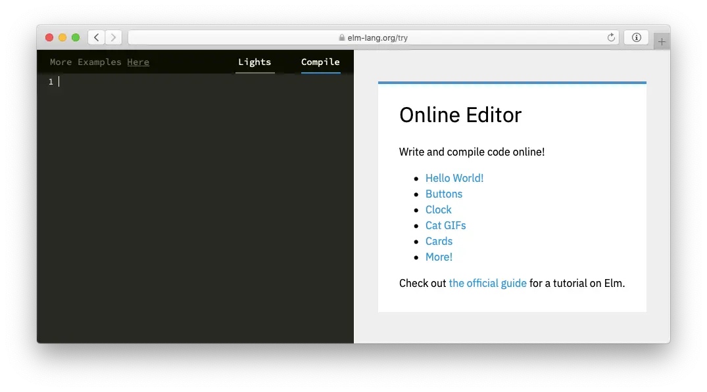

# معماری Elm

معماری Elm یک الگو برای طراحی برنامه‌های تعاملی، مانند وب اپلیکیشن‌ها و بازی‌ها است.

به نظر می‌رسد این معماری به طور طبیعی در Elm شکل می‌گیرد. به جای اینکه کسی آن را اختراع کند، برنامه‌نویسان اولیه Elm به طور مکرر الگوهای پایه مشابهی را در کد خود کشف می‌کردند. دیدن اینکه افراد بدون برنامه‌ریزی قبلی به کدهای خوب طراحی شده‌ای می‌رسند، کمی ترسناک بود!

این معماری در Elm آسان است، اما در هر پروژه front-end دیگری مفید است. در واقع، پروژه‌هایی مانند Redux از معماری Elm الهام گرفته‌اند، بنابراین ممکن است قبلا نسخه‌هایی از این الگو را دیده باشید. نکته این است که حتی اگر در نهایت نتوانید از Elm در محیط کار استفاده کنید، چیزهای زیادی با یادگیری این الگو بدست می‌آورید.

## الگوی پایه {#pattern}

برنامه‌های Elm همیشه به این شکل به نظر می‌رسند:

برنامه HTML تولید می‌کند تا بر روی صفحه نمایش داده شود، سپس کامپیوتر پیام‌هایی از آنچه در حال وقوع است ارسال می‌کند. "روی یک دکمه کلیک شد!"

اما درون برنامه Elm چه اتفاقی می‌افتد؟ این فرآیند به سه بخش تقسیم می‌شود:

  * **Model** &mdash; وضعیت برنامه
  * **View** &mdash; روشی برای تبدیل وضعیت برنامه به HTML
  * **Update** &mdash; روشی برای بروزرسانی وضعیت برنامه بر اساس پیام‌ها

این سه مفهوم هسته **معماری Elm** یا **TEA** را تشکیل می‌دهند.

چند مثال بعدی نشان می‌دهند که چگونه می‌توان از این الگو برای ورودی کاربر، مانند دکمه‌ها و فیلدهای متنی استفاده کرد. در ادامه، به هر یک از این مثال‌ها می‌پردازیم.

## همراهی کنید {#follow}

تمام مثال‌ها در ویرایشگر آنلاین موجود هستند:

این ویرایشگر، نکات را در گوشه بالا سمت چپ نشان می‌دهد:

<video id="hints-video" width="360" height="180" autoplay loop style="margin: 0.55em 0 1em 2em;" onclick="var v = document.getElementById('hints-video'); v.paused ? (v.play(), v.style.opacity = 1) : (v.pause(), v.style.opacity = 0.5)">
  <source src="../assets/hints.mp4" type="video/mp4">
</video>

اگر با چیزی گیج‌کننده مواجه شدید، حتما به این نکات دقت کنید!

***

!!! abstract "یادداشت مترجم"

	منظور از ویرایشگر آنلاین، محیطی از وبسایت **Elm** است که در آن می‌توانید برنامه‌‌های مختلف را مشاهده، ویرایش و کامپایل کنید. علاوه بر این محیط، جامعه کاربری ابزار دیگری برای اشتراک‌گذاری کد و پروژه در نظر گرفته است که با نام **Ellie** شناخته می‌شود. برای کسب اطلاعات بیشتر، به منابع زیر مراجعه کنید:

	- [ویرایشگر کد Elm][editor-elm]{: .external }
	- [ویرایشگر کد Ellie][editor-ellie]{: .external }

[editor-elm]: https://elm-lang.org/try
[editor-ellie]: https://ellie-app.com