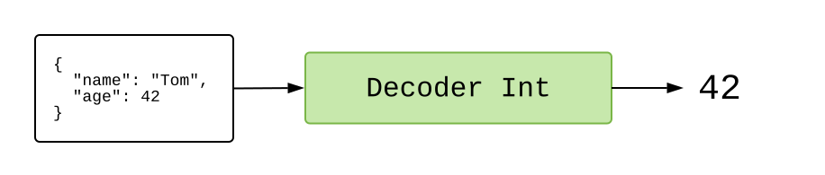
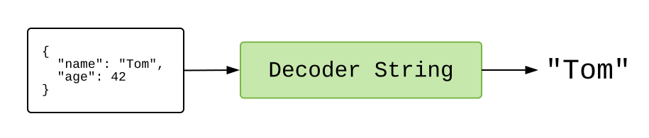

# JSON

در فصل قبل، برنامه‌ای دیدیم که از HTTP برای دریافت محتوای یک کتاب استفاده می‌کرد. این عالی است، اما تعداد زیادی از سرورها، داده را در یک فرمت خاص به نام JavaScript Object Notation یا JSON برمی‌گردانند.

بنابراین، برنامه بعدی نشان می‌دهد که چگونه می‌توانیم داده JSON را دریافت کنیم و به ما اجازه می‌دهد که با فشردن یک دکمه، نقل قول‌های تصادفی مجموعه‌ای از کتاب‌ها را نمایش دهیم. روی دکمه آبی "ویرایش" کلیک و کمی در برنامه جستجو کنید. شاید برخی از این کتاب‌ها را خوانده‌اید؟ **اکنون دکمه آبی را کلیک کنید!**

<div class="edit-link"><a href="https://elm-lang.org/examples/quotes">ویرایش</a></div>

```elm
import Browser
import Html exposing (..)
import Html.Attributes exposing (style)
import Html.Events exposing (..)
import Http
import Json.Decode exposing (Decoder, map4, field, int, string)


-- MAIN


main =
  Browser.element
    { init = init
    , update = update
    , subscriptions = subscriptions
    , view = view
    }


-- MODEL


type Model
  = Failure
  | Loading
  | Success Quote


type alias Quote =
  { quote : String
  , source : String
  , author : String
  , year : Int
  }


init : () -> (Model, Cmd Msg)
init _ =
  (Loading, getRandomQuote)


-- UPDATE


type Msg
  = MorePlease
  | GotQuote (Result Http.Error Quote)


update : Msg -> Model -> (Model, Cmd Msg)
update msg model =
  case msg of
    MorePlease ->
      (Loading, getRandomQuote)

    GotQuote result ->
      case result of
        Ok quote ->
          (Success quote, Cmd.none)

        Err _ ->
          (Failure, Cmd.none)


-- SUBSCRIPTIONS


subscriptions : Model -> Sub Msg
subscriptions model =
  Sub.none


-- VIEW


view : Model -> Html Msg
view model =
  div []
    [ h2 [] [ text "Random Quotes" ]
    , viewQuote model
    ]


viewQuote : Model -> Html Msg
viewQuote model =
  case model of
    Failure ->
      div []
        [ text "I could not load a random quote for some reason."
        , button [ onClick MorePlease ] [ text "Try Again!" ]
        ]

    Loading ->
      text "Loading..."

    Success quote ->
      div []
        [ button [ onClick MorePlease, style "display" "block" ] [ text "More Please!" ]
        , blockquote [] [ text quote.quote ]
        , p [ style "text-align" "right" ]
            [ text "— "
            , cite [] [ text quote.source ]
            , text (" by " ++ quote.author ++ " (" ++ String.fromInt quote.year ++ ")")
            ]
        ]


-- HTTP


getRandomQuote : Cmd Msg
getRandomQuote =
  Http.get
    { url = "https://elm-lang.org/api/random-quotes"
    , expect = Http.expectJson GotQuote quoteDecoder
    }


quoteDecoder : Decoder Quote
quoteDecoder =
  map4 Quote
    (field "quote" string)
    (field "source" string)
    (field "author" string)
    (field "year" int)
```

این برنامه به طور کلی مشابه نمونه قبلی است:

- تابع `init` برنامه را در حالت `Loading`، با یک دستور برای دریافت یک نقل قول تصادفی، شروع می‌کند.
- تابع `update` پیام `GotQuote` را برای هر بار که یک نقل قول جدید در دسترس است، مدیریت می‌کند. هر چه در آنجا اتفاق بیفتد، هیچ دستور اضافی نداریم. همچنین پیام `MorePlease` را زمانی که کسی دکمه را فشار می‌دهد، مدیریت می‌کند و دستوری برای دریافت نقل قول‌های تصادفی بیشتر صادر می‌کند.
- تابع `view` به شما نقل قول‌ها را نشان می‌دهد!

تفاوت اصلی در تعریف تابع `getRandomQuote` است. به جای استفاده از `Http.expectString` به `Http.expectJson` تغییر کرده‌ایم. این چه معنایی دارد؟

## JSON

زمانی که از [`/api/random-quotes`][api-quotes] برای یک نقل قول تصادفی درخواست می‌کنید، سرور یک رشته JSON مانند این تولید می‌کند:

```json
{
  "quote": "December used to be a month but it is now a year",
  "source": "Letters from a Stoic",
  "author": "Seneca",
  "year": 54
}
```

هیچ تضمینی درباره اطلاعات موجود در اینجا وجود ندارد. سرور می‌تواند نام فیلدها را تغییر دهد و فیلدها ممکن است در شرایط مختلف انواع متفاوتی داشته باشند. اصلا حساب و کتاب ندارد!

در جاوااسکریپت، رویکرد متداول این است که با تبدیل JSON به ساختار داده موجود، امیدوار باشیم که هیچ اشتباهی پیش نیاید. اما اگر یک اشتباه تایپی یا داده غیر منتظره‌ای وجود داشته باشد، در جایی از کد خود یک خطای زمان اجرا دریافت می‌کنید. آیا کد اشتباه بود؟ آیا داده اشتباه بود؟ وقت آن است که شروع به جستجو کنیم تا بفهمیم!

در Elm، رویکرد متداول این است که JSON را قبل از ورود به برنامه اعتبارسنجی کنیم. بنابراین اگر داده، ساختار غیرمنتظره‌ای داشته باشد، بلافاصله از آن مطلع می‌شویم. هیچ راهی برای عبور داده بد و ایجاد یک خطای زمان اجرا در برنامه وجود ندارد. این کار با استفاده از دیکودرهای JSON انجام می‌شود.

## دیکودرهای JSON

فرض کنید یک فایل JSON داریم:

```json
{
  "name": "Tom",
  "age": 42
}
```

باید آن را از طریق یک `Decoder` اجرا تا به اطلاعات خاصی دسترسی پیدا کنیم. بنابراین اگر بخواهیم `"age"` را دریافت کنیم، باید JSON را از طریق یک `Decoder Int` که دقیقا نحوه دسترسی به آن اطلاعات را توصیف می‌کند، اجرا کنیم:



اگر همه چیز خوب پیش برود، یک `Int` در طرف دیگر خواهیم داشت! و اگر بخواهیم `"name"` را دریافت کنیم، باید JSON را از طریق یک `Decoder String` که دقیقا نحوه دسترسی به آن را توصیف می‌کند، اجرا کنیم:



اگر همه چیز خوب پیش برود، یک `String` در طرف دیگر خواهیم داشت!

اما چگونه می‌توانیم دیکودرهایی مانند این ایجاد کنیم؟

## بلوک‌های سازنده

بسته [`elm/json`][elm-json] ماژول [`Json.Decode`][json.decode] را در اختیار ما می‌گذارد. این ماژول پر از دیکودرهای کوچک است که می‌توانیم آن‌ها را به هم متصل کنیم. بنابراین، برای دریافت `"age"` از `{ "name": "تام", "age": 42 }` دیکودر زیر را ایجاد می‌کنیم:

```elm
import Json.Decode exposing (Decoder, field, int)

ageDecoder : Decoder Int
ageDecoder =
  field "age" int

 -- int : Decoder Int
 -- field : String -> Decoder a -> Decoder a
```

تابع [`field`][json.decode.field] دو آرگومان می‌گیرد:

۱. `String` &mdash; نام یک فیلد. بنابراین یک شی با فیلد `"age"` را درخواست می‌کنیم.
۲. `Decoder a` &mdash; یک دیکودر برای مرحله بعدی. بنابراین اگر فیلد `"age"` وجود داشته باشد، این دیکودر را روی مقدار آن امتحان خواهیم کرد.

بنابراین، تابع `field "age" int` درخواست یک فیلد `"age"` را می‌کند و اگر وجود داشته باشد، دیکودر `Int` را اجرا می‌کند تا سعی کند یک عدد صحیح استخراج کند.

تقریبا همین کار را برای استخراج فیلد `"name"` انجام می‌دهیم:

```elm
import Json.Decode exposing (Decoder, field, string)

nameDecoder : Decoder String
nameDecoder =
  field "name" string

-- string : Decoder String
```

در این مورد، یک شی با فیلد `"name"` را درخواست می‌کنیم و اگر وجود داشته باشد، می‌خواهیم مقدار آن یک `String` باشد.

## ترکیب دیکودرها

اگر بخواهیم دو فیلد را دیکود کنیم چطور؟ دیکودرها را با استفاده از تابع [`map2`][json.decode.map2] به هم متصل می‌کنیم:

```elm
map2 : (a -> b -> value) -> Decoder a -> Decoder b -> Decoder value
```

این تابع دو دیکودر را می‌گیرد. آن‌ها را امتحان و نتایج آن‌ها را ترکیب می‌کند. اکنون می‌توانیم دو دیکودر مختلف را با هم ترکیب کنیم:

```elm
import Json.Decode exposing (Decoder, map2, field, string, int)

type alias Person =
  { name : String
  , age : Int
  }

personDecoder : Decoder Person
personDecoder =
  map2 Person
    (field "name" string)
    (field "age" int)
```

بنابراین، اگر از `personDecoder` روی `{ "name": "Tom", "age": 42 }` استفاده کنیم، یک مقدار Elm مانند `Person "Tom" 42` دریافت خواهیم کرد.

اگر واقعا بخواهیم پیاده‌سازی کاملی داشته باشیم، باید `personDecoder` را به صورت `map2 Person nameDecoder ageDecoder` تعریف و از دیکودرهای کوچک‌تر استفاده کنیم. پیشنهاد می‌کنم همیشه دیکودرهای خود را از بلوک‌های سازنده کوچک‌تر بسازید!

## دیکودرهای تو در تو

بسیاری از داده‌های JSON ساده و صاف نیستند. تصور کنید که `/api/random-quotes/v2` با اطلاعات بیشتری درباره نویسندگان منتشر شده است:

```json
{
  "quote": "December used to be a month but it is now a year",
  "source": "Letters from a Stoic",
  "author":
  {
    "name": "Seneca",
    "age": 68,
    "origin": "Cordoba"
  },
  "year": 54
}
```

می‌توانیم این سناریوی جدید را با دیکودرهای تو در تو مدیریت کنیم:

```elm
import Json.Decode exposing (Decoder, map2, map4, field, int, string)

type alias Quote =
  { quote : String
  , source : String
  , author : Person
  , year : Int
  }

quoteDecoder : Decoder Quote
quoteDecoder =
  map4 Quote
    (field "quote" string)
    (field "source" string)
    (field "author" personDecoder)
    (field "year" int)

type alias Person =
  { name : String
  , age : Int
  }

personDecoder : Decoder Person
personDecoder =
  map2 Person
    (field "name" string)
    (field "age" int)
```

توجه داشته باشید که به دیکود کردن فیلد `"origin"` نویسنده نمی‌پردازیم. دیکودرها می‌توانند فیلدها را نادیده بگیرند، این کار می‌تواند در استخراج مقدار کوچکی از داده بزرگ JSON بسیار مفید باشد.

## مراحل بعدی

در ماژول `Json.Decode` تعدادی تابع مهم وجود دارد که در اینجا به آن‌ها نپرداختیم:

- [`bool`](https://package.elm-lang.org/packages/elm/json/latest/Json-Decode#bool) : `Decoder Bool`
- [`list`](https://package.elm-lang.org/packages/elm/json/latest/Json-Decode#list) : `Decoder a -> Decoder (List a)`
- [`dict`](https://package.elm-lang.org/packages/elm/json/latest/Json-Decode#dict) : `Decoder a -> Decoder (Dict String a)`
- [`oneOf`](https://package.elm-lang.org/packages/elm/json/latest/Json-Decode#oneOf) : `List (Decoder a) -> Decoder a`

بنابراین، روش‌های مختلفی برای استخراج ساختار داده‌های متفاوت وجود دارد. تابع `oneOf` به ویژه برای JSON با ساختار نامنظم مفید است. (برای نمونه، ممکن است گاهی یک `Int` دریافت کنید و گاهی یک `String` که شامل اعداد است. این واقعا آزاردهنده است!)

تابع [`map2`][json.decode.map2] و [`map4`][json.decode.map4] را برای مدیریت اشیا با فیلدهای متعدد دیدیم. اما وقتی شروع به کار با اشیای بزرگ‌تر JSON می‌کنید، پیشنهاد می‌کنم نگاهی به بسته [`NoRedInk/elm-json-decode-pipeline`][json-decode-pipeline] بیندازید. این بسته، نوع داده پیچیده‌تری دارد، اما برخی توسعه‌دهندگان کار با آن را ترجیح می‌دهند.

> **واقعیت جالب:** داستان‌های زیادی شنیده‌ام که هنگام تغییر از جاوااسکریپت به Elm، باگ‌هایی در کد سرور پیدا شده است. دیکودرهایی که توسعه‌دهندگان می‌نویسند به عنوان یک مرحله اعتبارسنجی عمل کرده و موارد عجیب در مقادیر JSON را شناسایی می‌کنند. بنابراین، وقتی پروژه NoRedInk از React به Elm تغییر کرد، چند باگ در کد Ruby آن‌ها را آشکار کرد!

[api-quotes]: https://elm-lang.org/api/random-quotes
[elm-json]: https://package.elm-lang.org/packages/elm/json/latest/
[json.decode]: https://package.elm-lang.org/packages/elm/json/latest/Json-Decode
[json.decode.field]: https://package.elm-lang.org/packages/elm/json/latest/Json-Decode#field
[json.decode.map2]: https://package.elm-lang.org/packages/elm/json/latest/Json-Decode#map2
[json.decode.map4]: https://package.elm-lang.org/packages/elm/json/latest/Json-Decode#map4
[json-decode-pipeline]: https://package.elm-lang.org/packages/NoRedInk/elm-json-decode-pipeline/latest