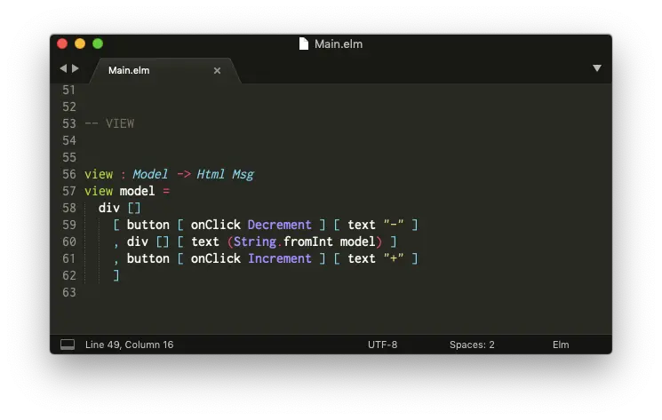

# نصب یک ویرایشگر کد

اولین قدم این است که یک ویرایشگر کد برای مدیریت فایل‌های Elm راه‌اندازی کنید.

تعدادی افزونه توسط اعضای جامعه کاربری برای طیف گسترده‌ای از ویرایشگرها نگهداری می‌شود. فهرستی از آن‌ها را می‌توانید در صفحه [افزونه‌های ویرایشگر][editor-plugins] مشاهده کنید.

راه‌اندازی یک ویرایشگر کد می‌تواند دشوار باشد، بنابراین شیوه راه‌اندازی Sublime Text را نشان می‌دهم. امیدوارم این شیوه، برای برنامه‌نویسان تازه کار و حرفه‌ای، مفید باشد.

## Sublime Text

**گام اول:** Sublime Text را از [وبسایت رسمی][sublime-text] دانلود کنید.

**گام دوم:** افزونه "Elm Syntax Highlighting" را نصب کنید.

- [ویندوز](https://github.com/evancz/elm-syntax-highlighting/blob/master/install/windows.md)
- [مک اواس](https://github.com/evancz/elm-syntax-highlighting/blob/master/install/mac.md)
- [لینوکس](https://github.com/evancz/elm-syntax-highlighting/blob/master/install/linux.md)

پس از گذراندن این مراحل، باید بتوانید فایل‌های Elm را با Syntax Highlighting باز کنید. کلمات کلیدی مانند `import` و `type` باید رنگی باشند تا خواندن کد آسان‌تر شود.

> **توجه:** گزینه‌های دیگری هم وجود دارد! اعضای جامعه کاربری، افزونه‌های دیگری برای ویرایشگرهای Emacs، IntelliJ، Vim، VS Code و بسیاری دیگر ایجاد کرده‌اند. سعی می‌کنیم صفحه [افزونه‌های ویرایشگر][editor-plugins] را با تمام گزینه‌های موجود، بروز نگه داریم!

[editor-plugins]: https://github.com/elm/editor-plugins
[sublime-text]: https://www.sublimetext.com