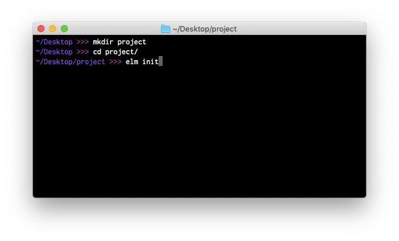

# نصب Elm

در این قسمت، فرآیند راه‌اندازی یک فایل اجرایی به نام `elm` را توضیح می‌دهیم. در ادامه، لینک‌های **نصب** این فایل قرار دارند:

- **ویندوز** - [فایل باینری](https://github.com/elm/compiler/releases/download/0.19.1/installer-for-windows.exe){: .external }
- **مک اواس** - [فایل باینری](https://github.com/elm/compiler/releases/download/0.19.1/installer-for-mac.pkg){: .external }
- **لینوکس** - [راهنمای نصب](https://github.com/elm/compiler/blob/master/installers/linux/README.md){: .external }

پس از اتمام نصب، ترمینال را در کامپیوتر خود باز کنید. ممکن است به نام `cmd.exe` یا `Command Prompt` در ویندوز شناخته شود.



با رفتن به دسکتاپ خود در ترمینال شروع کنید:

```bash
# Windows (but with <username> filled in with yours)
cd C:\Users\<username>\Desktop

# Mac and Linux
cd ~/Desktop
```

مرحله بعدی آشنا شدن با دستور `elm` است. من در یادگیری دستورات ترمینال بسیار مشکل داشتم، بنابراین سخت کار کردم تا دستور `elm` را آسان و کاربردی ارایه دهم. بیایید به چند سناریوی رایج بپردازیم.

## elm init
این دستور، یک پروژه جدید Elm را در دایرکتوری فعلی ایجاد می‌کند:

```bash
elm init
```

سعی کنید این دستور را اجرا کنید تا یک فایل `elm.json` و یک دایرکتوری `src/` ایجاد شود:

- [`elm.json`][elm.json]{: .external } پروژه شما را توصیف می‌کند.
- `src/` شامل سورس کد پروژه است.

حالا سعی کنید فایلی به نام `src/Main.elm` در ویرایشگر کد ایجاد و کد نمونه را از [برنامه دکمه‌ها][examples-buttons]{: .external } کپی کنید.

## elm reactor

این دستور، به شما کمک می‌کند تا پروژه Elm را بدون درگیر شدن با ترمینال بسازید. کافی است آن را در دایرکتوری اصلی پروژه به شیوه زیر اجرا کنید:

```bash
elm reactor
```

با اجرای دستور بالا، یک سرور در نشانی [`http://localhost:8000`][localhost] راه‌اندازی می‌شود. می‌توانید هر فایل Elm را اجرا کنید تا ببینید چگونه کامپایل می‌شود. دستور `elm reactor` را اجرا کنید، به لینک localhost و پورت ۸۰۰۰ بروید و سعی کنید فایل `src/Main.elm` خود را بررسی کنید!

## elm make

این دستور، سورس کد Elm را به جاوااسکریپت کامپایل می‌کند:

```bash
# Create an index.html file that you can open in your browser.
elm make src/Main.elm

# Create an optimized JS file to embed in a custom HTML document.
elm make src/Main.elm --optimize --output=elm.js
```

سعی کنید این دستورات را بر روی فایل `src/Main.elm` اجرا کنید.

این روش، متداول‌ترین شیوه برای کامپایل سورس کد Elm است. زمانی که مدیریت پروژه با `elm reactor` دشوار می‌شود، استفاده از این روش پیشنهاد می‌شود.

این دستور، پیام‌های مشابهی را تولید می‌کند که در ویرایشگر آنلاین و `elm reactor` مشاهده کرده‌اید. سال‌ها کار در این زمینه انجام شده است، اما اگر پیام غیر مربوطی مشاهده کردید، لطفا آن را در صفحه [کاتالوگ پیام خطا][error-message-catalog]{: .external } گزارش دهید. همیشه امکان بهبود وجود دارد!

## elm install

بسته‌های Elm در وبسایت [`package.elm-lang.org`][elm-packages]{: .external } قرار دارند.

فرض کنید می‌خواهید برای انجام برخی درخواست‌های HTTP از بسته‌های [`elm/http`][elm-http]{: .external } و [`elm/json`][elm-json]{: .external } استفاده کنید. این بسته‌ها را می‌توانید با استفاده از دستورات زیر در پروژه خود نصب کنید:

```bash
elm install elm/http
elm install elm/json
```

این دستورات، با افزودن و مدیریت وابستگی‌ها در فایل `elm.json`، امکان استفاده از آن‌ها را برای شما فراهم می‌کنند. این کار به شما اجازه می‌دهد که با فراخوانی `import Http` در فایل سورس کد پروژه، از توابعی مانند `Http.get` استفاده کنید.

## نکات و ترفندها {#tips-and-tricks}

**اول**، نگران به خاطر سپردن تمام این موارد نباشید!

همیشه می‌توانید دستور `elm --help` را اجرا کنید تا یک نمای کلی از قابلیت‌های `elm` به دست آورید.

همچنین می‌توانید دستوراتی مانند `elm make --help` و `elm repl --help` را اجرا کنید تا نکاتی درباره یک دستور خاص به دست آورید. اگر می‌خواهید بررسی کنید که کدام پرچم‌ها در دسترس هستند و چه کاری انجام می‌دهند، این روش خوبی است.

**دوم**، نگران نباشید اگر کار در ترمینال مدتی برای شما طول بکشد!

بیش از یک دهه است که از آن استفاده می‌کنم و هنوز هم نمی‌توانم به خاطر بسپارم که چگونه فایل‌ها را فشرده کنم یاتمام فایل‌های Elm را در یک دایرکتوری پیدا کنم. هنوز هم بسیاری از چیزها را جستجو می‌کنم!

* * *

با اتمام فرآیند نصب `elm`، دسترسی از طریق ترمینال و تنظیم ویرایشگر کد، بیایید به یادگیری Elm ادامه دهیم!

*[HTTP]: Hypertext Transfer Protocol

[elm.json]: https://github.com/elm/compiler/blob/master/docs/elm.json/application.md
[examples-buttons]: https://elm-lang.org/examples/buttons
[localhost]: http://localhost:8000
[error-message-catalog]: https://github.com/elm/error-message-catalog/issues
[elm-packages]: https://package.elm-lang.org
[elm-http]: https://package.elm-lang.org/packages/elm/http/latest
[elm-json]: https://package.elm-lang.org/packages/elm/json/latest