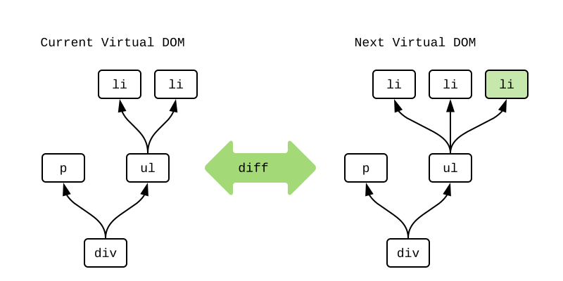

# `Html.Lazy`

بسته [`elm/html`][elm-html]{: .external } برای نمایش محتوا روی صفحه استفاده می‌شود. برای درک چگونگی بهینه‌سازی آن، ابتدا باید یاد بگیریم چگونه کار می‌کند!

## DOM

هنگام ایجاد یک فایل HTML، بطور مستقیم چیزی شبیه به این می‌نویسید:

```html
<div>
  <p>Chair alternatives include:</p>
  <ul>
    <li>seiza</li>
    <li>chabudai</li>
  </ul>
</div>
```

می‌توانید آن را به عنوان تولید یک ساختار داده "DOM" در پس‌زمینه ببینید:


جعبه‌های سیاه نمایانگر اشیا سنگین DOM با صدها ویژگی هستند. هنگامی که هر یک از آن‌ها تغییر کند، می‌تواند باعث رِندر و بازچینی پرهزینه محتوای صفحه شود.

## Virtual DOM

هنگام ایجاد یک فایل Elm با استفاده از بسته `elm/html`، بطور مستقیم چیزی شبیه به این می‌نویسید:

```elm
viewChairAlts : List String -> Html msg
viewChairAlts chairAlts =
  div []
    [ p [] [ text "Chair alternatives include:" ]
    , ul [] (List.map viewAlt chairAlts)
    ]

viewAlt : String -> Html msg
viewAlt chairAlt =
  li [] [ text chairAlt ]
```

می‌توانید تابع `viewChairAlts ["seiza","chabudai"]` را به عنوان تولید یک ساختار داده “Virtual DOM” در پس‌زمینه ببینید:


جعبه‌های سفید نمایانگر اشیا سبک DOM، با ویژگی‌هایی که شما مشخص کرده‌اید، هستند. ایجاد آن‌ها هرگز نمی‌تواند باعث رِندر یا بازچینی صفحه شود. نکته این است که، در مقایسه با گره‌های DOM، تخصیص منابع به این گره‌ها بسیار ارزان‌تر است!

## Render

اگر همیشه با این گره‌های مجازی در Elm کار می‌کنیم، چگونه به DOM که روی صفحه می‌بینیم تبدیل می‌شوند؟ وقتی یک برنامه Elm شروع می‌شود، به این شکل عمل می‌کند:

- تابع `init` برای دریافت مدل اولیه فراخوانی می‌شود.
- تابع `view` برای دریافت گره‌های مجازی اولیه فراخوانی می‌شود.

اکنون که گره‌های مجازی را داریم، یک نسخه دقیق در DOM ایجاد می‌کنیم:


بسیار خوب! اما وقتی صفحه تغییر می‌کند چطور؟ دوباره‌سازی کل DOM برای هر فِریم بهینه نیست، پس چکار کنیم؟

## Diff

پس از اینکه DOM اولیه را داریم، به کار با گره‌های مجازی ادامه می‌دهیم. هر زمان که `Model` تغییر کند، تابع `view` را اجرا می‌کنیم. در ادامه، گره‌های مجازی حاصل را “تفاوت‌گذاری” می‌کنیم تا بفهمیم چگونه کمترین دستکاری DOM را داشته باشیم.

تصور کنید که `Model` یک صندلی جایگزین جدید دریافت می‌کند و می‌خواهیم یک گره `li` جدید برای آن اضافه کنیم. در پس‌زمینه، Elm گره‌های مجازی **فعلی** و **بعدی** را برای شناسایی هرگونه تغییر، تفاوت‌گذاری می‌کند:



کامپایلر متوجه شد که یک `li` سوم اضافه شده است. آن را به رنگ سبز علامت‌گذاری کردم. Elm اکنون دقیقا می‌داند که چگونه DOM را تغییر دهد تا با آن مطابقت داشته باشد. بنابراین، فقط آن `li` جدید را وارد می‌کند:


تفاوت‌گذاری، امکان حداقل دستکاری DOM را فراهم می‌کند. اگر هیچ تفاوتی پیدا نشود، نیازی به دست زدن به DOM نداریم! بنابراین، این فرآیند به حداقل رساندن رِندرها و بازچینی‌هایی که باید انجام شود، کمک می‌کند.

اما آیا می‌توانیم کار کمتری انجام دهیم؟

## `Html.Lazy` {#html-lazy}

ماژول [`Html.Lazy`][html.lazy]{: .external } این امکان را فراهم می‌کند که حتی گره‌های مجازی را نیز نسازیم! ایده اصلی این ماژول، تابع `lazy` است:

```elm
lazy : (a -> Html msg) -> a -> Html msg
```

به مثال صندلی برگردیم، تابع `viewChairAlts ["seiza","chabudai"]` را فراخوانی کردیم، اما به راحتی می‌توانستیم تابع `lazy viewChairAlts ["seiza","chabudai"]` را فراخوانی کنیم. این فراخوانی، یک گره “تنبل” به این شکل تخصیص می‌دهد:


این گره فقط یک ارجاع به تابع و آرگومان‌های آن را نگه می‌دارد. Elm می‌تواند تابع و آرگومان‌ها را با هم ترکیب کند تا در صورت نیاز کل ساختار را تولید کند، اما همیشه نیاز نیست!

یکی از ویژگی‌های جالب Elm تضمین “ورودی یکسان، خروجی یکسان” برای توابع است. بنابراین هر زمان که در حین تفاوت‌گذاری گره‌های مجازی با دو گره “تنبل” مواجه شویم، می‌پرسیم آیا تابع یکسان است؟ آیا آرگومان‌ها یکسان هستند؟ اگر همه آن‌ها یکسان باشند، می‌دانیم که گره‌های مجازی حاصل نیز یکسان هستند! **بنابراین می‌توانیم بطور کامل از ساخت گره‌های مجازی صرف نظر کنیم!** اگر هر یک از آن‌ها تغییر کرده باشد، می‌توانیم گره‌های مجازی را بسازیم و یک تفاوت‌گذاری عادی انجام دهیم.

!!! note "یادداشت"

	چه زمانی دو مقدار “یکسان” هستند؟ برای بهینه‌سازی عملکرد، از عملگر `===` جاوااسکریپت در پس‌زمینه استفاده می‌کنیم:

	- برابری ساختاری برای `Int`، `Float`، `String`، `Char` و `Bool` استفاده می‌شود.
	- برابری ارجاعی برای `Record`، `List`، `Dictionary` و `Custom Type` استفاده می‌شود.

	برابری ساختار به این معنی است که `4` همان `4` است، مهم نیست که چگونه آن را تولید کرده‌اید. برابری ارجاع به این معنی است که اشاره‌گر واقعی در حافظه باید یکسان باشد. استفاده از برابری ارجاع همیشه ارزان و بزرگی آن `O(1)` است، حتی زمانی که ساختار داده هزاران یا میلیون‌ها ورودی داشته باشد. بنابراین، بیشتر به این مربوط می‌شود که اطمینان حاصل کنیم استفاده از تابع `lazy` هرگز بطور تصادفی کد را کُند نمی‌کند. تمام بررسی‌ها بسیار ارزان هستند!

## کاربرد {#usage}

بهترین مکان برای قرار دادن یک گره تنبل، در بالاترین قسمت برنامه یا `root` است. بسیاری از برنامه‌ها طوری طراحی شده‌اند که مناطق بصری متمایزی مانند بالای صفحه، نوار کناری، محتوای اصلی و پایین صفحه داشته باشند. زمانی که توسعه‌دهندگان با یکی از آن‌ها کار می‌کنند، به ندرت به دیگری دست می‌زنند. این کار، منجر به ایجاد خطوط طبیعی برای فراخوانی تابع `lazy` می‌شود!

برای نمونه، در [پیاده‌سازی TodoMVC][elm-todomvc]{: .external }، تابع `view` به این شکل تعریف شده است:

```elm
view : Model -> Html Msg
view model =
  div
    [ class "todomvc-wrapper"
    , style "visibility" "hidden"
    ]
    [ section
        [ class "todoapp" ]
        [ lazy viewInput model.field
        , lazy2 viewEntries model.visibility model.entries
        , lazy2 viewControls model.visibility model.entries
        ]
    , infoFooter
    ]
```

توجه کنید که ورودی کاربر، سطرها و کنترل‌ها همه در گره‌های تنبل جداگانه‌ای قرار دارند. بنابراین می‌توان هر تعداد کاراکتر در ورودی تایپ کرد بدون اینکه هرگز گره‌های مجازی برای سطرها یا کنترل‌ها ساخته شود. آن‌ها در حال تغییر نیستند! در نتیجه، اولین نکته این است که **سعی کنید از گره‌های تنبل در بالاترین قسمت برنامه استفاده کنید.**

همچنین، استفاده از تابع `lazy` در فهرست طولانی اقلام، می‌تواند مفید باشد. در برنامه TodoMVC، همه چیز درباره افزودن ورودی‌ها به فهرست کارها است. می‌توانید به راحتی صدها ورودی داشته باشید، اما آن‌ها به ندرت تغییر می‌کنند. این بخش، یک کاندیدای عالی برای تنبلی است! با تغییر تابع `viewEntry entry` به `lazy viewEntry entry` می‌توانیم از تخصیص منابعی که به ندرت مفید هستند، صرف نظر کنیم. در نتیجه، دومین نکته این است که **سعی کنید از گره‌های تنبل در ساختارهای تکراری استفاده کنید که هر مورد آن به ندرت تغییر می‌کند.**

## خلاصه {#summary}

دستکاری DOM بسیار پر هزینه‌تر از چیزی است که در یک رابط کاربری عادی اتفاق می‌افتد. شما می‌توانید هر کاری که می‌خواهید با ساختارهای داده پیچیده انجام دهید، اما در نهایت تنها چیزی که اهمیت دارد این است که چقدر بطور موفقیت‌آمیز از تابع `lazy` استفاده می‌کنید.

در قسمت بعد، یک تکنیک برای استفاده بهتر از تابع `lazy` می‌آموزیم!

[elm-html]: https://package.elm-lang.org/packages/elm/html/latest
[html.lazy]: https://package.elm-lang.org/packages/elm/html/latest/Html-Lazy
[elm-todomvc]: https://github.com/evancz/elm-todomvc